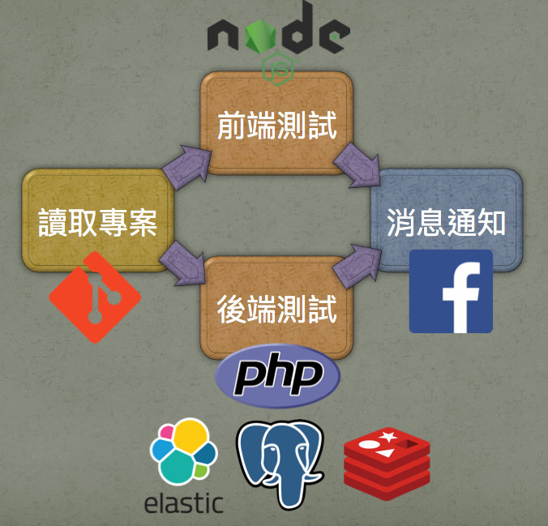

# Laravel + Drone

[Drone](https://github.com/drone/drone) is a Continuous Delivery system built on container technology. Drone uses a simple yaml configuration file, a superset of docker-compose, to define and execute Pipelines inside Docker containers.

[](https://cloud.drone.io/go-training/drone-laravel-example)

## Screenshots



```yml
---
kind: pipeline
name: default

platform:
  os: linux
  arch: amd64

steps:
- name: frontend
  pull: if-not-exists
  image: node:8.1.2
  commands:
  - node -v
  - npm -v
  - yarn --version
  - yarn config set cache-folder .yarn-cache
  - yarn install
  - yarn run production

- name: backend
  pull: if-not-exists
  image: laradock/workspace:1.8-71
  commands:
  - php -v
  - composer -V
  - cp .env.example .env
  - composer install --prefer-dist
  - php artisan key:generate
  - php artisan migrate
  - ./vendor/bin/phpunit

services:
- name: elasticsearch
  pull: if-not-exists
  image: docker.elastic.co/elasticsearch/elasticsearch:5.3.0

- name: redis
  pull: if-not-exists
  image: redis:latest

- name: postgres
  pull: if-not-exists
  image: postgres:9.5.5
  environment:
    POSTGRES_DB: homestead
    POSTGRES_PASSWORD: secret
    POSTGRES_USER: homestead

...

```

## Testing your Drone config

Please try the following command to test drone config in local machine.

```sh
drone exec
```
